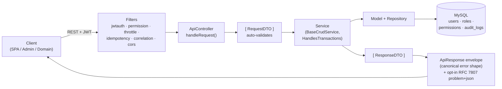

# CodeIgniter 4 API Starter Kit 🚀

An opinionated REST API starter template with an **Automated Scaffolding Engine**, strict DTO-first architecture, and comprehensive quality guardrails. Built for personal and small-team projects — not a framework, not a product, just a well-structured starting point.

## Architecture at a glance



The DTO-first contract is enforced by `make:crud` scaffolding — generated code never bypasses the layers. JWT validation, permission gating, rate limiting, and observability are all filter-level concerns; controllers stay thin.

## Key Features

- **⚡ Zero-Error Scaffolding:** Generate 100% functional CRUD modules in seconds (DTOs, Services, Models, Migrations, OpenAPI). [Docs](docs/tech/scaffolding-engine.md)
- **🛡️ DTO-First Architecture:** Strict data validation and transfer using PHP 8.2 readonly classes. [Docs](docs/architecture/README.md)
- **🔌 Smart Wiring:** Automatic service registration in `Config/Services.php` and domain traits. [Docs](docs/tech/scaffolding-engine.md)
- **📜 OpenAPI 3.0 Documentation:** Automatically generated and synchronized documentation. [Docs](docs/tech/openapi.md)
- **✅ Built-in Quality:** Git pre-commit hooks (PHPStan, CS-Fixer, i18n) and comprehensive test suites. [Docs](docs/template/QUALITY_GATES.md)
- **🗃️ Advanced Patterns:** Generic Repository, Filterable/Searchable traits, and Audit Trail. [Docs](docs/architecture/PATTERNS.md)

## Getting Started

The fastest path is the **interactive bootstrapper** — a single command that clones the template, generates all secrets, creates both databases, runs migrations, and provisions the first superadmin:

```bash
/bin/bash -c "$(curl -fsSL https://raw.githubusercontent.com/dcardenasl/ci4-api-starter/main/install.sh)"
```

`install.sh` handles everything interactively:
- Checks prerequisites (PHP 8.2+, Composer, MySQL)
- Collects project name, DB credentials, and admin email
- Clones the repo into a new directory
- Runs `composer install` (auto-installs Git pre-commit hooks)
- Generates `.env`, JWT secret, and encryption key
- Creates main and test databases, runs all migrations
- Bootstraps the first superadmin account
- Optionally resets the git history for a clean start
- Generates the initial Swagger documentation

### Manual Setup (already cloned / advanced)

```bash
git clone https://github.com/dcardenasl/ci4-api-starter.git
cd ci4-api-starter
composer install
cp .env.example .env
# Fill in DB credentials and JWT_SECRET_KEY in .env
php spark migrate
php spark users:bootstrap-superadmin --email superadmin@example.com --password 'StrongPass123!' --first-name Super --last-name Admin
```

> **File storage:** uploaded files are stored under `writable/uploads/` (outside the
> `public/` document root, by design — see `app/Libraries/Storage/Drivers/LocalDriver.php`).
> A `public/uploads` symlink to `writable/uploads` is committed to the repo so a plain
> `git clone` already has it; it's the one controlled way uploaded assets get an
> unauthenticated public URL (e.g. for `` tags), without exposing the rest of
> `writable/` (logs, sessions, cache). If the symlink is ever missing — e.g. after a
> deploy/packaging step that doesn't preserve symlinks — re-run
> `bash -c 'source scripts/setup.sh && ci4_setup_uploads_symlink'` or recreate it
> manually with `ln -s ../writable/uploads public/uploads`.

> For Docker workflows: `docker compose up -d` is enough — the entrypoint generates secrets, runs migrations, and seeds RBAC on first start. Then `docker compose exec app php spark users:bootstrap-superadmin --email <e> --password <p>` to create the first user. See `GETTING_STARTED.md` for details.
> `init.sh` is the supported setup entrypoint for a host-mode setup (no Docker).

## Development Workflow

### Generate a new Module
To create a complete CRUD resource with validation and documentation, use the `vendor/bin/make-crud.sh` wrapper (shipped by the `dcardenasl/ci4-api-scaffolding` dev dependency) — it handles shell-safe argument passing (pipes in `--fields`), runs `composer cs-fix` automatically, and prints the exact follow-up commands:

```bash
bash vendor/bin/make-crud.sh Product Catalog \
  'name:string:required|searchable,price:decimal:required|filterable,category_id:fk:categories:required' \
  yes
```

Signature: `bash vendor/bin/make-crud.sh <Resource> <Domain> '<Fields>' [SoftDelete=yes] [Route]`

> For interactive scaffolding (prompts per field), run `php spark make:crud Product --domain Catalog` directly. The wrapper is preferred for non-TTY environments (CI, Claude Code, scripts) because shell expansion can eat pipe characters in `--fields`.

**Next Steps:**
1. `php spark module:check Product --domain Catalog` to validate wiring.
2. `php spark migrate` to apply the generated table.
3. Restart the dev server so new route files get detected: `pkill -f 'spark serve'; php spark serve &`.
4. `php spark swagger:generate` to update the OpenAPI spec.

Full playbook: [`docs/template/CRUD_FROM_ZERO.md`](docs/template/CRUD_FROM_ZERO.md).

## Quality Enforcement
This project enforces high standards. Every commit runs:
- **PHP CS Fixer:** For code style consistency.
- **PHPStan:** For static analysis and type safety.
- **i18n-check:** To prevent hardcoded strings in DTOs/Services.

To run the full quality suite manually:
```bash
composer quality
```

## Secret Rotation

Rotate secrets immediately if compromised, every 90 days for compliance, or when team members with access leave.

**JWT Secret** (`JWT_SECRET_KEY` in `.env`):
```bash
# 1. Generate a new secret (64+ characters recommended)
openssl rand -base64 64

# 2. Update .env
JWT_SECRET_KEY='<paste-new-secret-here>'

# 3. Restart the server
# All existing tokens are immediately invalidated — users must log in again
```

**Encryption Key** (`encryption.key` in `.env`):
```bash
# 1. Generate new key
openssl rand -hex 32

# 2. Update .env
encryption.key=hex2bin:<paste-new-key-here>

# 3. Restart the server
# Note: Existing encrypted data may become unreadable
```

**⚠️ Important Notes:**
- Rotating the JWT secret invalidates all active tokens immediately
- Rotating the encryption key may invalidate encrypted session data
- Always test secret rotation in staging first
- Keep old secrets for 24-48 hours in case you need to revert
- Document the date and reason for rotation for audit trails

## Documentation
- [Architecture Overview](ARCHITECTURE.md)
- [API Documentation](public/docs/index.html) (After generating swagger)
- [Getting Started Guide](GETTING_STARTED.md)
