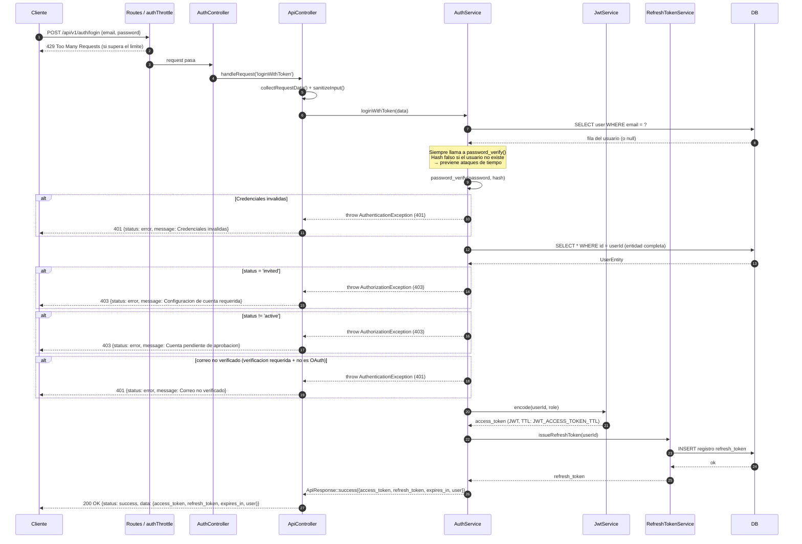

# Flujo de inicio de sesion

## Descripcion general

El flujo de inicio de sesion autentica a un usuario con credenciales de correo electronico y contrasena y, en caso de exito, emite un token de acceso JWT de corta duracion y un token de actualizacion de larga duracion. Es el punto de entrada a todas las areas protegidas de la API.

El flujo incluye dos medidas de seguridad importantes: **prevencion de ataques de tiempo** (el hash de la contrasena siempre se verifica, incluso cuando el usuario no existe) y **limitacion de velocidad** mediante el filtro `authThrottle`.

---

## Paso a paso

1. El cliente envia `POST /api/v1/auth/login` con `email` y `password`.
2. El filtro `authThrottle` aplica un limite estricto de peticiones por IP. Las peticiones en exceso reciben `429 Too Many Requests`.
3. `AuthController::login()` llama a `handleRequest('loginWithToken')`.
4. `ApiController::collectRequestData()` combina GET, POST y el cuerpo JSON; sanea strings con `strip_tags()`.
5. `AuthService::loginWithToken()` delega al metodo interno `login()`:
   - Busca al usuario por `email` en la base de datos.
   - Siempre ejecuta `password_verify()` — contra el hash real si el usuario existe, o contra un hash BCRYPT falso si no existe. Esto mantiene el tiempo de respuesta constante y previene ataques de tiempo.
   - Si la contrasena es incorrecta o el usuario no existe, lanza `AuthenticationException` (401).
6. Tras la validacion de credenciales, `loginWithToken()` vuelve a obtener la entidad completa del usuario y ejecuta dos guardas de estado:
   - `validateUserStatusForLogin()`: si `status = 'invited'` lanza `AuthorizationException` (403); si `status != 'active'` (p.ej. `pending_approval`) tambien lanza `AuthorizationException` (403).
   - `validateEmailVerification()`: si la verificacion de correo es requerida (`AUTH_REQUIRE_EMAIL_VERIFICATION=true`) y `email_verified_at` es nulo, y el usuario no es OAuth, lanza `AuthenticationException` (401).
7. `JwtService::encode()` genera un token de acceso JWT firmado (TTL: `JWT_ACCESS_TOKEN_TTL`, por defecto 3600 s).
8. `RefreshTokenService::issueRefreshToken()` genera un token de actualizacion y lo almacena en la base de datos (TTL: `JWT_REFRESH_TOKEN_TTL`, por defecto 604800 s).
9. Respuesta: `200 OK` con `{ access_token, refresh_token, expires_in, user }`.

---

## Diagrama



---

## Validaciones clave

- El correo electronico y la contrasena son obligatorios; si falta alguno se lanza `AuthenticationException` antes de cualquier consulta a la base de datos.
- `password_verify()` siempre es invocado para prevenir ataques de tiempo — la duracion es identica haya o no usuario.
- El `status` debe ser `'active'`. Los usuarios con estado `invited` o `pending_approval` son bloqueados.
- La verificacion de correo se aplica cuando `AUTH_REQUIRE_EMAIL_VERIFICATION=true` (o el helper `is_email_verification_required()` retorna true). Los usuarios OAuth (`oauth_provider = 'google'`) estan exentos.
- El filtro `authThrottle` aplica un limite de velocidad estricto especificamente para los endpoints de autenticacion.

---

## Casos de error

| Condicion | Excepcion | HTTP | Notas |
|-----------|-----------|------|-------|
| Falta email o contrasena | `AuthenticationException` | 401 | Antes de cualquier consulta a DB |
| Contrasena incorrecta o usuario no encontrado | `AuthenticationException` | 401 | Mismo mensaje — sin enumeracion |
| Estado de la cuenta es `invited` | `AuthorizationException` | 403 | Debe establecer contrasena primero |
| Estado `pending_approval` o cualquier estado no activo | `AuthorizationException` | 403 | El admin debe aprobar primero |
| Correo no verificado | `AuthenticationException` | 401 | Solo cuando la verificacion es requerida |
| Limite de velocidad superado | — (filtro) | 429 | Sin excepcion, el filtro responde directamente |

---

## Ejemplo

```bash
curl -X POST http://localhost:8080/api/v1/auth/login \
  -H "Content-Type: application/json" \
  -d '{
    "email": "usuario@ejemplo.com",
    "password": "MiClave123!"
  }'
```

Respuesta exitosa:

```json
{
  "status": "success",
  "data": {
    "access_token": "eyJ0eXAiOiJKV1Q...",
    "refresh_token": "def50200...",
    "expires_in": 3600,
    "user": {
      "id": 1,
      "email": "usuario@ejemplo.com",
      "first_name": "Ana",
      "last_name": "Garcia",
      "role": "user"
    }
  }
}
```
