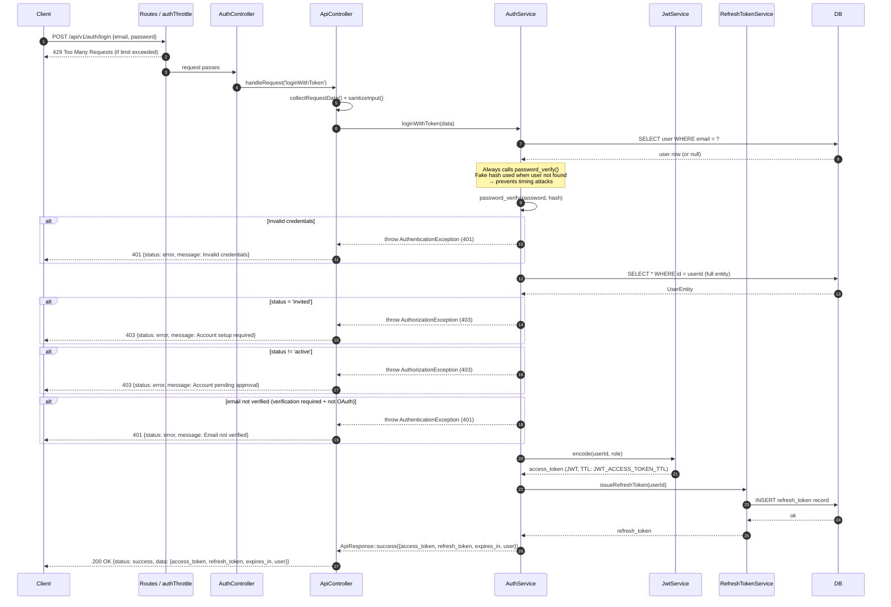

# Auth Login Flow

## Overview

The login flow authenticates a user with email and password credentials and, on success, issues a short-lived JWT access token and a long-lived refresh token. It is the entry point to all protected areas of the API.

The flow includes two important security measures: **timing-attack prevention** (the password hash is always verified, even when the user does not exist) and **rate limiting** via the `authThrottle` filter.

---

## Step-by-step

1. Client sends `POST /api/v1/auth/login` with `email` and `password`.
2. The `authThrottle` filter enforces a strict per-IP request limit. Excess requests receive `429 Too Many Requests`.
3. `AuthController::login()` calls `handleRequest('loginWithToken')`.
4. `ApiController::collectRequestData()` merges GET, POST, and JSON body; sanitizes strings with `strip_tags()`.
5. `AuthService::loginWithToken()` delegates to the internal `login()` method:
   - Looks up the user by `email` in the database.
   - Always runs `password_verify()` — against the real hash if the user exists, or against a fake BCRYPT hash if the user does not. This keeps the response time constant and prevents timing attacks.
   - If the password is wrong or the user does not exist, throws `AuthenticationException` (401).
6. After credential validation, `loginWithToken()` re-fetches the full user entity and runs two status guards:
   - `validateUserStatusForLogin()`: if `status = 'invited'` throws `AuthorizationException` (403); if `status != 'active'` (e.g. `pending_approval`) also throws `AuthorizationException` (403).
   - `validateEmailVerification()`: if email verification is required (`AUTH_REQUIRE_EMAIL_VERIFICATION=true`) and `email_verified_at` is null, and the user is not an OAuth user, throws `AuthenticationException` (401).
7. `JwtService::encode()` generates a signed JWT access token (TTL: `JWT_ACCESS_TOKEN_TTL`, default 3600 s).
8. `RefreshTokenService::issueRefreshToken()` generates a refresh token and stores it in the database (TTL: `JWT_REFRESH_TOKEN_TTL`, default 604800 s).
9. Response: `200 OK` with `{ access_token, refresh_token, expires_in, user }`.

---

## Diagram



---

## Key validations

- Email and password are required; missing either throws `AuthenticationException` before any DB query.
- `password_verify()` is always called to prevent timing attacks — the duration is identical whether or not the user exists.
- `status` must be `'active'`. Users with `invited` or `pending_approval` status are blocked.
- Email verification is enforced when `AUTH_REQUIRE_EMAIL_VERIFICATION=true` (or the helper `is_email_verification_required()` returns true). OAuth users (`oauth_provider = 'google'`) are exempt.
- The `authThrottle` filter applies a strict rate limit specifically for authentication endpoints.

---

## Error cases

| Condition | Exception | HTTP | Notes |
|-----------|-----------|------|-------|
| Missing email or password | `AuthenticationException` | 401 | Before DB query |
| Wrong password or user not found | `AuthenticationException` | 401 | Same message — no enumeration |
| Account status is `invited` | `AuthorizationException` | 403 | Must set password first |
| Account status is `pending_approval` or any non-active status | `AuthorizationException` | 403 | Admin must approve first |
| Email not verified | `AuthenticationException` | 401 | Only when verification required |
| Rate limit exceeded | — (filter) | 429 | No exception, filter returns directly |

---

## Example

```bash
curl -X POST http://localhost:8080/api/v1/auth/login \
  -H "Content-Type: application/json" \
  -d '{
    "email": "user@example.com",
    "password": "MyPass123!"
  }'
```

Successful response:

```json
{
  "status": "success",
  "data": {
    "access_token": "eyJ0eXAiOiJKV1Q...",
    "refresh_token": "def50200...",
    "expires_in": 3600,
    "user": {
      "id": 1,
      "email": "user@example.com",
      "first_name": "Jane",
      "last_name": "Doe",
      "role": "user"
    }
  }
}
```
