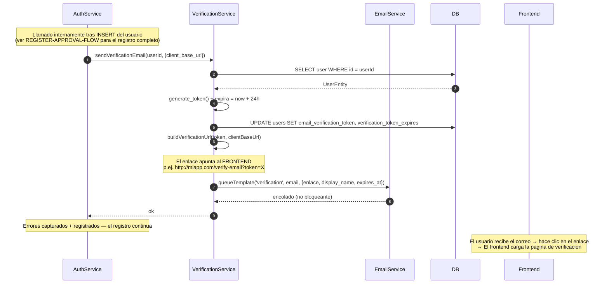
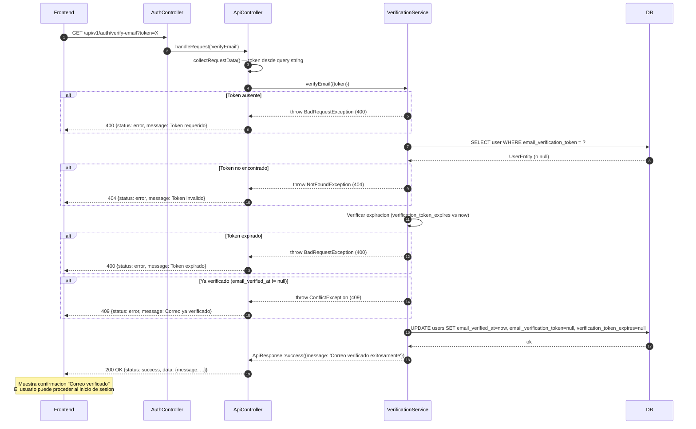
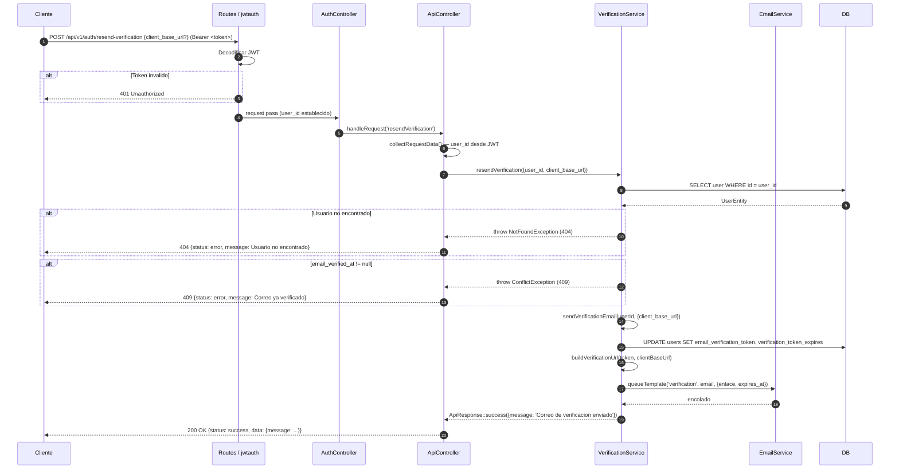

# Flujo de verificacion de correo electronico

## Descripcion general

La verificacion de correo confirma que la direccion de correo proporcionada durante el registro pertenece al usuario. Es un flujo de 3 pasos: el correo de verificacion se envia automaticamente tras el registro, el usuario hace clic en el enlace del correo que lo lleva al **frontend**, y el frontend llama a la API para completar la verificacion. Tambien existe un endpoint de reenvio disponible para usuarios autenticados.

La verificacion puede deshabilitarse globalmente con `AUTH_REQUIRE_EMAIL_VERIFICATION=false`. Cuando esta deshabilitada, los usuarios pueden iniciar sesion inmediatamente tras el registro (sujeto a la aprobacion del admin). Cuando esta habilitada, tanto la verificacion de correo como la aprobacion del admin son requeridas antes de permitir el inicio de sesion.

Los enlaces generados en este flujo apuntan a la **aplicacion frontend** a traves de `ResolvesWebAppLinks`, no directamente a la API.

---

## Paso 1 — Envio automatico tras el registro (interno)

Este paso no tiene un endpoint dedicado — es disparado internamente desde `AuthService::register()`.

### Paso a paso

1. `AuthService::register()` inserta el nuevo usuario.
2. Llama a `VerificationService::sendVerificationEmail(userId, {client_base_url})`:
   - Obtiene la entidad del usuario desde la base de datos.
   - Genera un token aleatorio via `generate_token()`.
   - Calcula la expiracion: 24 horas a partir de ahora.
   - Actualiza el usuario: `email_verification_token = token`, `verification_token_expires = expiracion`.
   - Construye el enlace de verificacion: `ResolvesWebAppLinks::buildVerificationUrl(token, clientBaseUrl)` → `{frontendBaseUrl}/verify-email?token=X`
   - Encola el correo de verificacion (no bloqueante).
3. Cualquier error en este paso es capturado, registrado y silenciado — no falla el registro.

### Diagrama



---

## Paso 2 — Verificar el correo (el frontend llama a la API tras el clic del usuario)

**Endpoint:** `GET /api/v1/auth/verify-email?token=X`

El frontend extrae el token del parametro de la URL (colocado alli por el enlace del correo) y llama a este endpoint.

### Paso a paso

1. El frontend envia `GET /api/v1/auth/verify-email?token=X`.
2. `VerificationService::verifyEmail({token})` valida:
   - El token no puede estar vacio (`BadRequestException` si falta).
   - Busca al usuario por `email_verification_token`. No encontrado → `NotFoundException` (404).
   - Verifica si el token ha expirado (`verification_token_expires < now`). Expirado → `BadRequestException` (400).
   - Verifica si el correo ya fue verificado (`email_verified_at != null`). Ya verificado → `ConflictException` (409).
3. Marca el correo como verificado:
   - `email_verified_at = now()`
   - `email_verification_token = null`
   - `verification_token_expires = null`
4. Respuesta: `200 OK` con `"Correo verificado exitosamente"`.
5. El frontend muestra un mensaje de exito. El usuario puede proceder al inicio de sesion (si la cuenta tambien esta `active`).

### Diagrama



---

## Paso 3 — Reenviar correo de verificacion

**Endpoint:** `POST /api/v1/auth/resend-verification`

**Requiere:** filtro `jwtauth` (usuario autenticado, pero el correo aun puede no estar verificado).

### Paso a paso

1. El usuario autenticado envia `POST /api/v1/auth/resend-verification` con `client_base_url` opcional.
2. El filtro `jwtauth` valida el token Bearer.
3. `VerificationService::resendVerification({user_id, client_base_url})`:
   - Obtiene al usuario desde la base de datos.
   - Si `email_verified_at != null` → `ConflictException` (409) ya verificado.
   - Llama nuevamente a `sendVerificationEmail(userId, data)` (igual que el paso 1), que genera un nuevo token, actualiza el usuario y encola un nuevo correo.
4. Respuesta: `200 OK` con `"Correo de verificacion enviado"`.

### Diagrama



---

## Flujo completo frontend-a-API

```
[El usuario se registra]
    → La API crea la cuenta con status='pending_approval'
    → La API encola el correo de verificacion (token valido 24h)

[El correo llega a la bandeja de entrada]
    → Enlace: http://miapp.com/verify-email?token=X
    → (El enlace apunta al FRONTEND, no a la API)

[El usuario hace clic en el enlace]
    → El frontend carga la pagina /verify-email
    → El frontend extrae el token de la URL

[Frontend → API]
    → GET /api/v1/auth/verify-email?token=X
    → 200 OK

[Frontend]
    → Muestra mensaje de confirmacion "Correo verificado"

[El admin aprueba la cuenta]
    → POST /api/v1/users/{id}/approve (accion del admin)
    → El estado del usuario pasa a 'active'

[El usuario inicia sesion]
    → POST /api/v1/auth/login
    → 200 OK con access_token y refresh_token
```

---

## Resolucion de URL para enlaces de correo (ResolvesWebAppLinks)

Los enlaces del correo de verificacion apuntan al **frontend**, no a la API. El trait `ResolvesWebAppLinks` resuelve la URL base con la siguiente prioridad:

1. `client_base_url` del cuerpo del request — validada contra la lista de permitidos `WEBAPP_ALLOWED_BASE_URLS` (en produccion se requiere `https`). Si no esta en la lista: registra una advertencia y usa el respaldo.
2. Respaldo: variable de entorno `WEBAPP_BASE_URL`.
3. Respaldo: `app.baseURL`.

El formato de la URL del frontend es: `{baseUrl}/verify-email?token={token}`

Variables de entorno requeridas:

```env
WEBAPP_BASE_URL=http://localhost:8081
WEBAPP_ALLOWED_BASE_URLS=http://localhost:8081,https://miapp.com
```

---

## Validaciones clave

- La busqueda del token se hace consultando la columna `email_verification_token` — un token por usuario a la vez.
- La expiracion del token es de 24 horas. Se verifica contra la columna `verification_token_expires`.
- Intentar verificar un correo ya verificado devuelve `ConflictException` (409), no un exito silencioso.
- `sendVerificationEmail()` tambien lanza `ConflictException` si se llama sobre un usuario ya verificado — esto protege el endpoint de reenvio de operaciones innecesarias.
- Los errores del correo de verificacion durante el registro son capturados y registrados silenciosamente para nunca bloquear la creacion de la cuenta.

---

## Casos de error

| Condicion | Excepcion | HTTP | Notas |
|-----------|-----------|------|-------|
| Token ausente (paso de verificacion) | `BadRequestException` | 400 | Token requerido |
| Token no encontrado en DB | `NotFoundException` | 404 | Invalido o ya consumido |
| Token expirado | `BadRequestException` | 400 | `verification_token_expires < now` |
| Correo ya verificado | `ConflictException` | 409 | Cualquier paso — verificar o reenviar |
| Usuario no encontrado (reenvio) | `NotFoundException` | 404 | Usuario eliminado tras emitir token |
| JWT invalido (reenvio) | — (filtro) | 401 | Filtro jwtauth |

---

## Ejemplos

Paso 2 — verificar correo (llamado por el frontend tras el clic del usuario):

```bash
curl "http://localhost:8080/api/v1/auth/verify-email?token=abc123def456"
```

Paso 3 — reenviar correo de verificacion:

```bash
curl -X POST http://localhost:8080/api/v1/auth/resend-verification \
  -H "Authorization: Bearer TU_TOKEN_DE_ACCESO" \
  -H "Content-Type: application/json" \
  -d '{
    "client_base_url": "https://miapp.com"
  }'
```
