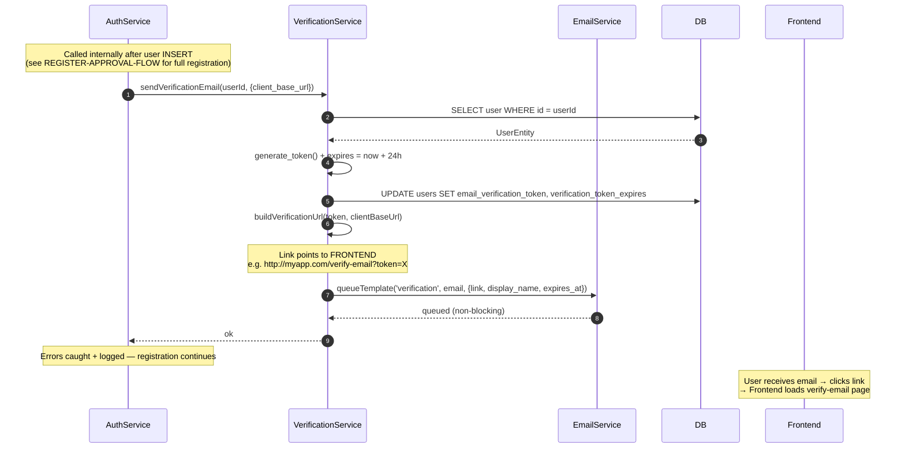
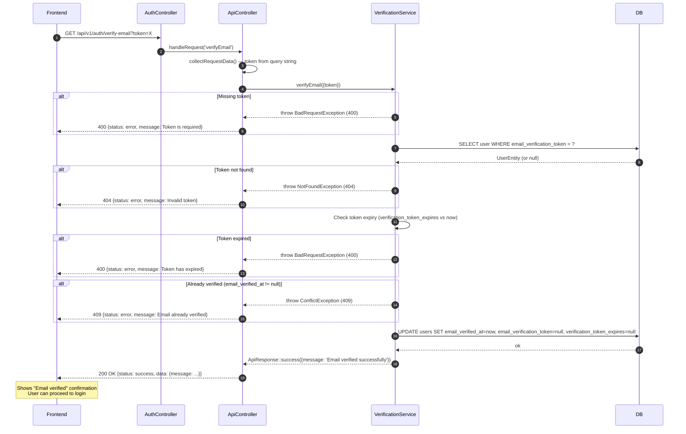
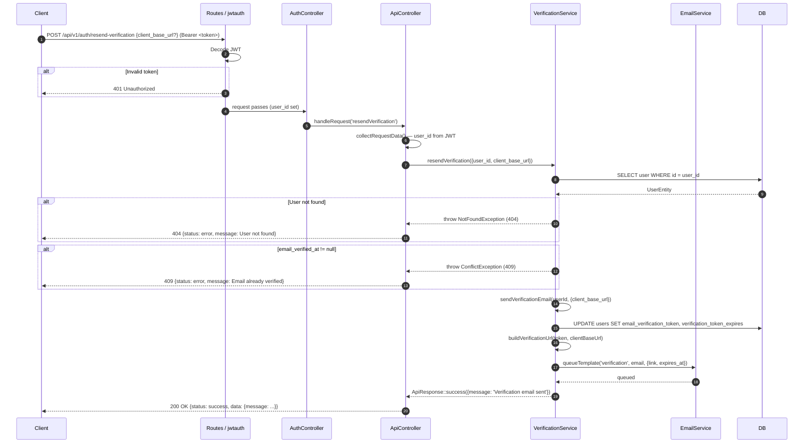

# Email Verification Flow

## Overview

Email verification confirms that the email address provided during registration belongs to the user. It is a 3-step flow: the verification email is sent automatically after registration, the user clicks the link in the email which takes them to the **frontend**, and the frontend calls the API to complete verification. A resend endpoint is also available for authenticated users.

Verification can be disabled globally by setting `AUTH_REQUIRE_EMAIL_VERIFICATION=false`. When disabled, users can log in immediately after registration (subject to admin approval). When enabled, both email verification and admin approval are required before login is allowed.

Email links generated in this flow point to the **frontend application** via `ResolvesWebAppLinks`, not directly to the API.

---

## Step 1 — Automatic send after registration (internal)

This step has no dedicated endpoint — it is triggered internally from `AuthService::register()`.

### Step-by-step

1. `AuthService::register()` inserts the new user.
2. Calls `VerificationService::sendVerificationEmail(userId, {client_base_url})`:
   - Fetches the user entity from the database.
   - Generates a random token via `generate_token()`.
   - Computes expiry: 24 hours from now.
   - Updates the user: `email_verification_token = token`, `verification_token_expires = expiresAt`.
   - Builds the verification link: `ResolvesWebAppLinks::buildVerificationUrl(token, clientBaseUrl)` → `{frontendBaseUrl}/verify-email?token=X`
   - Queues the verification email (non-blocking).
3. Any errors in this step are caught, logged, and silently swallowed — they do not fail the registration.

### Diagram



---

## Step 2 — Verify email (frontend calls API after user clicks link)

**Endpoint:** `GET /api/v1/auth/verify-email?token=X`

The frontend extracts the token from the URL query string (placed there by the email link) and calls this endpoint.

### Step-by-step

1. Frontend sends `GET /api/v1/auth/verify-email?token=X`.
2. `VerificationService::verifyEmail({token})` validates:
   - Token must not be empty (`BadRequestException` if missing).
   - Finds the user by `email_verification_token`. Not found → `NotFoundException` (404).
   - Checks whether the token has expired (`verification_token_expires < now`). Expired → `BadRequestException` (400).
   - Checks whether the email is already verified (`email_verified_at != null`). Already verified → `ConflictException` (409).
3. Marks the email as verified:
   - `email_verified_at = now()`
   - `email_verification_token = null`
   - `verification_token_expires = null`
4. Response: `200 OK` with `"Email verified successfully"`.
5. The frontend shows a success message. The user can now proceed to login (if the account is also `active`).

### Diagram



---

## Step 3 — Resend verification email

**Endpoint:** `POST /api/v1/auth/resend-verification`

**Requires:** `jwtauth` filter (authenticated user, but email may not yet be verified).

### Step-by-step

1. Authenticated user (token already obtained or in a pre-verified state) sends `POST /api/v1/auth/resend-verification` with optional `client_base_url`.
2. The `jwtauth` filter validates the Bearer token.
3. `VerificationService::resendVerification({user_id, client_base_url})`:
   - Fetches the user from the database.
   - If `email_verified_at != null` → `ConflictException` (409) already verified.
   - Calls `sendVerificationEmail(userId, data)` again (same as step 1), which generates a new token, updates the user, and queues a new email.
4. Response: `200 OK` with `"Verification email sent"`.

### Diagram



---

## Complete frontend-to-API flow

```
[User registers]
    → API creates account with status='pending_approval'
    → API queues verification email (token valid 24h)

[Email arrives in inbox]
    → Link: http://myapp.com/verify-email?token=X
    → (Link points to FRONTEND, not the API)

[User clicks link]
    → Frontend loads the /verify-email page
    → Frontend extracts token from URL

[Frontend → API]
    → GET /api/v1/auth/verify-email?token=X
    → 200 OK

[Frontend]
    → Shows "Email verified" confirmation message

[Admin approves the account]
    → POST /api/v1/users/{id}/approve (admin action)
    → User status becomes 'active'

[User logs in]
    → POST /api/v1/auth/login
    → 200 OK with access_token and refresh_token
```

---

## URL resolution for email links (ResolvesWebAppLinks)

Verification email links point to the **frontend**, not the API. The `ResolvesWebAppLinks` trait resolves the base URL using the following priority:

1. `client_base_url` from the request body — validated against the `WEBAPP_ALLOWED_BASE_URLS` allowlist (production requires `https`). If not in the allowlist: logs a warning and falls back.
2. Fallback: `WEBAPP_BASE_URL` environment variable.
3. Fallback: `app.baseURL`.

The frontend URL format is: `{baseUrl}/verify-email?token={token}`

Required environment variables:

```env
WEBAPP_BASE_URL=http://localhost:8081
WEBAPP_ALLOWED_BASE_URLS=http://localhost:8081,https://myapp.com
```

---

## Key validations

- Token lookup is done by querying `email_verification_token` column — one token per user at a time.
- Token expiry is 24 hours. Expiry is checked against the `verification_token_expires` column.
- Attempting to verify an already-verified email returns `ConflictException` (409), not a silent success.
- `sendVerificationEmail()` will also throw `ConflictException` if called on an already-verified user — this protects the resend endpoint from unnecessary operations.
- Verification email errors during registration are caught and logged silently so they never block account creation.

---

## Error cases

| Condition | Exception | HTTP | Notes |
|-----------|-----------|------|-------|
| Missing token (verify step) | `BadRequestException` | 400 | Token is required |
| Token not found in DB | `NotFoundException` | 404 | Invalid or already consumed |
| Token expired | `BadRequestException` | 400 | `verification_token_expires < now` |
| Email already verified | `ConflictException` | 409 | Any step — verify or resend |
| User not found (resend) | `NotFoundException` | 404 | User deleted after token issued |
| Invalid JWT (resend) | — (filter) | 401 | jwtauth filter |

---

## Examples

Step 2 — verify email (called by frontend after user clicks link):

```bash
curl "http://localhost:8080/api/v1/auth/verify-email?token=abc123def456"
```

Step 3 — resend verification email:

```bash
curl -X POST http://localhost:8080/api/v1/auth/resend-verification \
  -H "Authorization: Bearer YOUR_ACCESS_TOKEN" \
  -H "Content-Type: application/json" \
  -d '{
    "client_base_url": "https://myapp.com"
  }'
```
