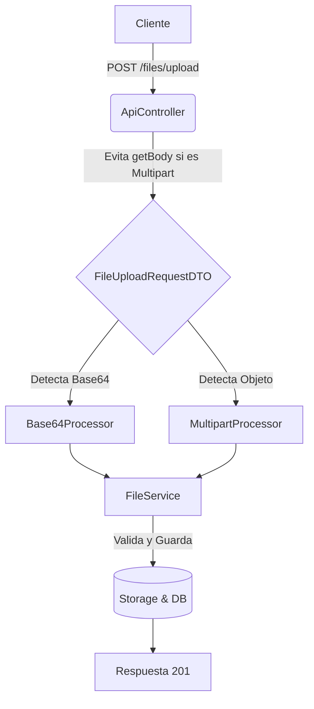

# Flujo de Subida de Archivos (Crítico)

Este flujo es una de las partes más sensibles de la arquitectura. Cualquier cambio en `ApiController` o en la gestión de Requests puede romperlo.

## ⚠️ Reglas de Oro (Arquitectura)

1.  **NO consumir el Body prematuramente:** En `ApiController::collectRequestData`, nunca se debe llamar a `$request->getBody()` si la petición es `multipart/form-data`. Hacerlo consume el stream `php://input` y PHP no podrá procesar los archivos (`$_FILES` quedará vacío).
2.  **Detección Multipart Híbrida:** La detección de si una petición es multipart debe ser robusta. No confíes solo en el header `Content-Type`; verifica también si `getFiles()` ya tiene datos.
3.  **Resiliencia del DTO:** El `FileUploadRequestDTO` debe ser capaz de extraer el archivo sin importar si viene como un objeto `UploadedFile` (Multipart), un array de datos o una cadena **Base64**.

## Modos de Subida Soportados

El API es flexible para garantizar compatibilidad con diversos clientes (web, móvil, cURL):

### 1. Modo Base64 (Recomendado para Admin)
Es el más fiable porque evita problemas de límites de cURL y protocolos multipart complejos.
- **Endpoint:** `POST /api/v1/files/upload`
- **Payload:** JSON estándar.
- **Campo:** `file` debe contener un Data URI (ej: `data:image/png;base64,...`).

### 2. Modo Multipart (Estándar HTML)
- **Endpoint:** `POST /api/v1/files/upload`
- **Payload:** `multipart/form-data`.
- **Campo:** `file` (binario).

## Proceso Interno

1.  **Gateway:** El filtro `JwtAuthFilter` inyecta el `userId` en el contexto.
2.  **Extracción:** `FileUploadRequestDTO` busca el archivo en el payload. Si detecta un string largo o prefijo `data:`, usa el `Base64Processor`. Si detecta un objeto de CodeIgniter, usa el `MultipartProcessor`.
3.  **Procesamiento:**
    - Se valida el tamaño (env: `FILE_MAX_SIZE`).
    - Se valida la extensión (env: `FILE_ALLOWED_TYPES`).
4.  **Almacenamiento:**
    - Se guarda físicamente vía `StorageManager` (Local o S3).
    - Se registra en la base de datos con metadata y URL pública.

## Diagrama de Flujo

## Solución de Problemas Comunes

- **"No se subió ningún archivo":** Probablemente alguien añadió un `log_message` que llama a `$request->getBody()` en el controlador base antes de procesar los archivos.
- **"Error de tipos en Validación":** CodeIgniter 4.6+ es estricto. Si el DTO recibe un objeto `UploadedFile`, el validador puede fallar. Asegúrate de que el DTO mapee correctamente a tipos escalares cuando sea posible.
