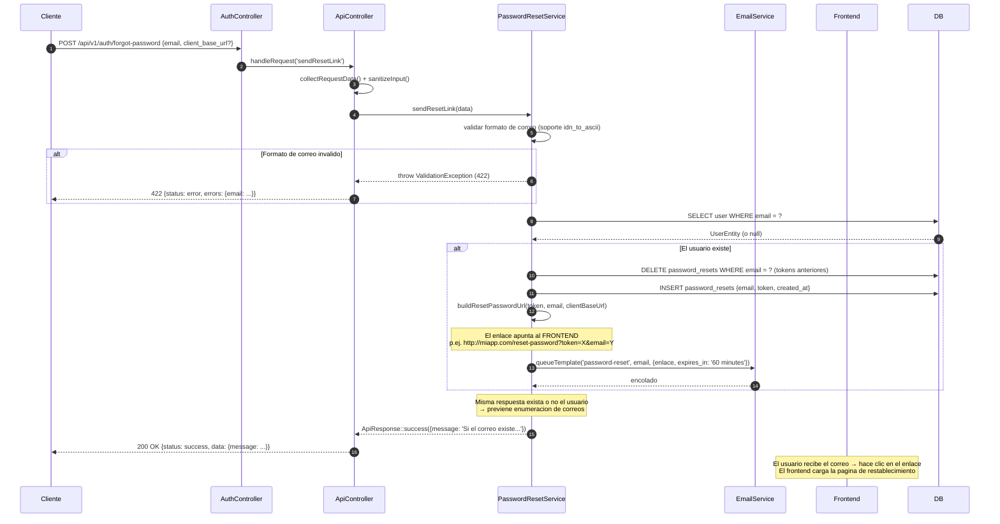
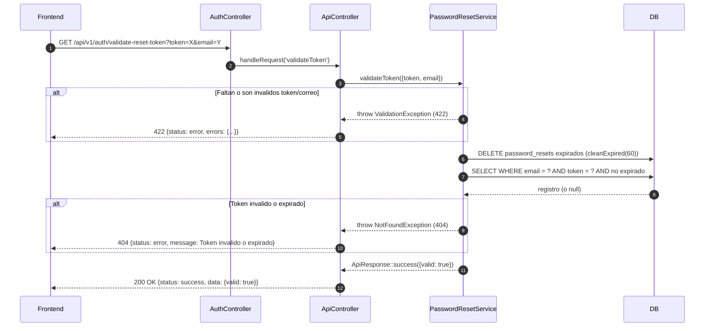
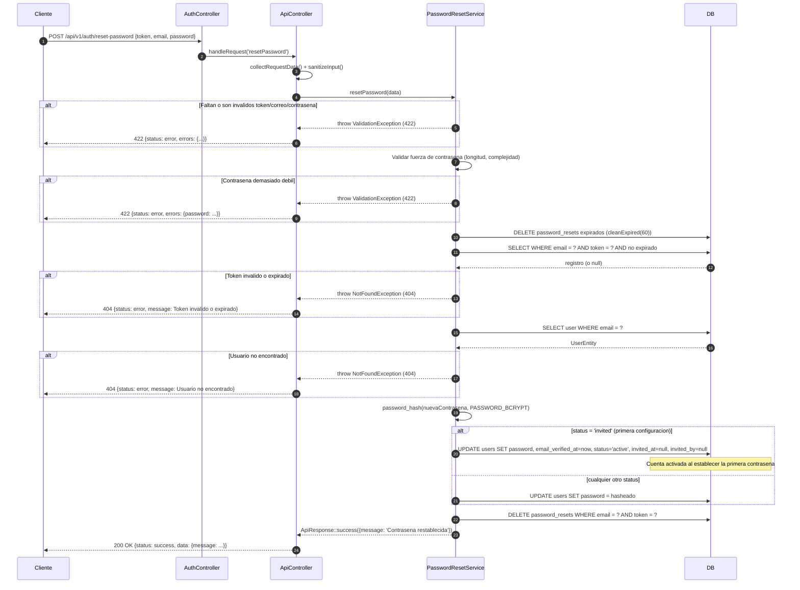

# Flujo de restablecimiento de contrasena

## Descripcion general

El flujo de restablecimiento de contrasena es un proceso de 3 pasos que permite a un usuario recuperar el acceso a su cuenta sin conocer su contrasena actual. Tambien funciona como el **flujo de configuracion de cuenta para usuarios invitados por el admin** — cuando un usuario en estado `invited` restablece su contrasena por primera vez, la cuenta se activa automaticamente.

Los enlaces generados durante este flujo apuntan a la **aplicacion frontend**, no directamente a la API. El frontend es responsable de mostrar el formulario de restablecimiento y luego llamar a la API con los valores enviados.

---

## Paso 1 — Solicitar un enlace de restablecimiento

**Endpoint:** `POST /api/v1/auth/forgot-password`

### Paso a paso

1. El cliente envia el request con `email` y opcionalmente `client_base_url`.
2. `PasswordResetService::sendResetLink()` valida el formato del correo (soporta nombres de dominio internacionales via `idn_to_ascii()`). Formato invalido → `ValidationException` (422).
3. Busca al usuario por `email` en la base de datos.
4. **Independientemente de si el usuario existe**, la respuesta siempre es el mismo mensaje de exito (medida de seguridad anti-enumeracion).
5. Si el usuario existe:
   - Genera un token aleatorio seguro via `generate_token()`.
   - Elimina cualquier token de restablecimiento previo para ese correo (solo un token activo a la vez).
   - Inserta un nuevo registro en `password_resets`.
   - Construye el enlace usando `ResolvesWebAppLinks::buildResetPasswordUrl(token, email, clientBaseUrl)` → apunta al **frontend** (p.ej. `http://miapp.com/reset-password?token=X&email=Y`).
   - Encola el correo de restablecimiento con expiracion de 60 minutos (no bloqueante).
6. Respuesta: `200 OK` con `"Si el correo existe, se ha enviado un enlace de restablecimiento"`.

### Diagrama



---

## Paso 2 — Validar el token de restablecimiento

**Endpoint:** `GET /api/v1/auth/validate-reset-token?token=X&email=Y`

Llamado por el frontend cuando carga la pagina de restablecimiento, antes de mostrar el formulario, para confirmar que el token no ha expirado.

### Paso a paso

1. El frontend envia el token y el correo desde los parametros de la URL.
2. `PasswordResetService::validateToken()` valida `token` y `email` mediante `validateOrFail($data, 'auth', 'password_reset_validate_token')`. Campos faltantes/invalidos → `ValidationException` (422).
3. Limpia tokens expirados de la base de datos (`passwordResetModel->cleanExpired(60)`).
4. Verifica si el token es valido y pertenece al correo (`isValidToken(email, token, 60)`).
5. Invalido o expirado → `NotFoundException` (404).
6. Respuesta: `200 OK` con `{ valid: true }`.

### Diagrama



---

## Paso 3 — Restablecer la contrasena

**Endpoint:** `POST /api/v1/auth/reset-password`

Llamado por el frontend cuando el usuario envia el formulario de restablecimiento.

### Paso a paso

1. El cliente envia `token`, `email` y `password`.
2. `PasswordResetService::resetPassword()` valida `token`, `email` y `password` mediante `validateOrFail($data, 'auth', 'password_reset')`.
3. La politica de contrasena se aplica con la regla `strong_password`:
   - Minimo 8 caracteres.
   - Maximo 128 caracteres.
   - Debe contener mayuscula, minuscula, digito y caracter especial.
   - Falla → `ValidationException` (422).
4. Limpia tokens expirados y luego revalida el token contra la base de datos. Invalido/expirado → `NotFoundException` (404).
5. Busca al usuario por correo. No encontrado → `NotFoundException` (404).
6. Hashea la nueva contrasena con `PASSWORD_BCRYPT`.
7. Si el `status = 'invited'` (configuracion por primera vez via enlace de invitacion): activa la cuenta estableciendo `email_verified_at = now()`, `status = 'active'` y limpiando `invited_at` e `invited_by`.
8. Elimina el token usado de la base de datos.
9. Respuesta: `200 OK` con `"Contrasena restablecida exitosamente"`.

### Diagrama



---

## Resolucion de URL para enlaces de correo (ResolvesWebAppLinks)

Los enlaces de restablecimiento apuntan al **frontend**, no a la API. El trait `ResolvesWebAppLinks` resuelve la URL base con la siguiente prioridad:

1. `client_base_url` del cuerpo del request — validada contra la lista de permitidos `WEBAPP_ALLOWED_BASE_URLS` (en produccion se requiere `https`).
2. Respaldo: variable de entorno `WEBAPP_BASE_URL`.
3. Respaldo: `app.baseURL`.

El formato de la URL del frontend es: `{baseUrl}/reset-password?token={token}&email={email_codificado}`

Variables de entorno requeridas:

```env
WEBAPP_BASE_URL=http://localhost:8081
WEBAPP_ALLOWED_BASE_URLS=http://localhost:8081,https://miapp.com
```

---

## Validaciones clave

- La validacion del formato de correo soporta nombres de dominio internacionales (IDN / punycode).
- Se devuelve la misma respuesta de exito exista o no el correo — previene enumeracion de correos.
- Solo un token activo de restablecimiento por correo en cualquier momento. Los tokens anteriores se eliminan antes de insertar uno nuevo.
- Expiracion del token: 60 minutos. Los tokens expirados se limpian antes de cada validacion.
- Complejidad de la contrasena: 8-128 caracteres, mayuscula + minuscula + digito + caracter especial.
- Los usuarios en estado `invited` son activados automaticamente al establecer su contrasena — esta es la via de incorporacion para cuentas creadas por el admin.

---

## Casos de error

| Condicion | Excepcion | HTTP | Notas |
|-----------|-----------|------|-------|
| Formato de correo invalido | `ValidationException` | 422 | Paso 1 — validacion de correo |
| Faltan o son invalidos token/correo (paso de validacion) | `ValidationException` | 422 | Paso 2 |
| Token no encontrado o expirado (validacion) | `NotFoundException` | 404 | Paso 2 |
| Faltan o son invalidos token/correo/contrasena (restablecimiento) | `ValidationException` | 422 | Paso 3 |
| Contrasena debil | `ValidationException` | 422 | Paso 3 |
| Token no encontrado o expirado (restablecimiento) | `NotFoundException` | 404 | Paso 3 |
| Usuario no encontrado por correo (restablecimiento) | `NotFoundException` | 404 | Paso 3 |

---

## Ejemplo

Paso 1 — solicitar enlace de restablecimiento:

```bash
curl -X POST http://localhost:8080/api/v1/auth/forgot-password \
  -H "Content-Type: application/json" \
  -d '{
    "email": "usuario@ejemplo.com",
    "client_base_url": "https://miapp.com"
  }'
```

Paso 2 — validar token (llamado por el frontend):

```bash
curl "http://localhost:8080/api/v1/auth/validate-reset-token?token=abc123&email=usuario%40ejemplo.com"
```

Paso 3 — restablecer contrasena (llamado por el frontend tras el envio del formulario):

```bash
curl -X POST http://localhost:8080/api/v1/auth/reset-password \
  -H "Content-Type: application/json" \
  -d '{
    "token": "abc123",
    "email": "usuario@ejemplo.com",
    "password": "NuevaClave456@"
  }'
```
