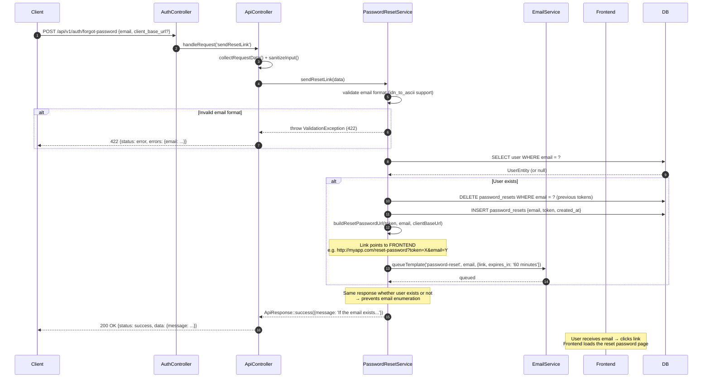
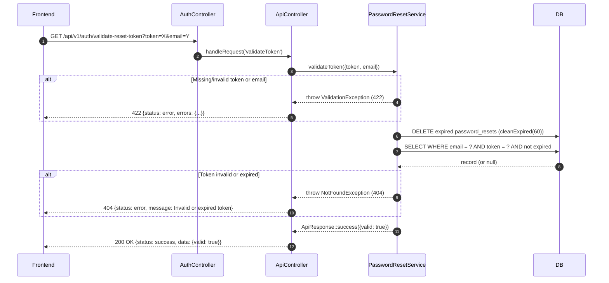
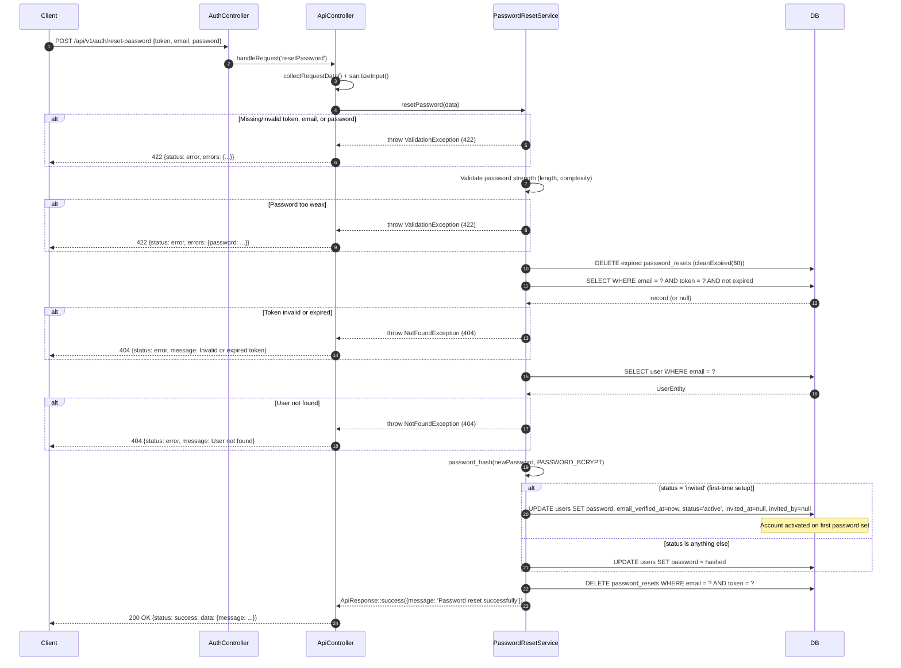

# Password Reset Flow

## Overview

The password reset flow is a 3-step process that allows a user to regain access to their account without knowing their current password. It also doubles as the **account setup flow for admin-invited users** — when a user in `invited` status resets their password for the first time, the account is automatically activated.

Email links generated during this flow point to the **frontend application**, not to the API directly. The frontend is responsible for presenting the reset form and then calling the API with the submitted values.

---

## Step 1 — Request a reset link

**Endpoint:** `POST /api/v1/auth/forgot-password`

### Step-by-step

1. Client sends the request with `email` and optionally `client_base_url`.
2. `PasswordResetService::sendResetLink()` validates the email format (supports international domain names via `idn_to_ascii()`). Invalid format → `ValidationException` (422).
3. Looks up the user by `email` in the database.
4. **Regardless of whether the user exists**, the response is always the same success message (anti-enumeration security measure).
5. If the user exists:
   - Generates a secure random token via `generate_token()`.
   - Deletes any previous reset tokens for that email (only one active token at a time).
   - Inserts a new `password_resets` record.
   - Builds the reset link using `ResolvesWebAppLinks::buildResetPasswordUrl(token, email, clientBaseUrl)` → points to the **frontend** (e.g. `http://myapp.com/reset-password?token=X&email=Y`).
   - Queues the reset email with 60-minute expiry (non-blocking).
6. Response: `200 OK` with `"If the email exists, a reset link has been sent"`.

### Diagram



---

## Step 2 — Validate the reset token

**Endpoint:** `GET /api/v1/auth/validate-reset-token?token=X&email=Y`

Called by the frontend when the reset page loads, before showing the form, to confirm the token has not expired.

### Step-by-step

1. Frontend sends the token and email from the URL query string.
2. `PasswordResetService::validateToken()` validates `token` and `email` through `validateOrFail($data, 'auth', 'password_reset_validate_token')`. Missing/invalid fields → `ValidationException` (422).
3. Cleans expired tokens from the database (`passwordResetModel->cleanExpired(60)`).
4. Checks whether the token is valid and belongs to the email (`isValidToken(email, token, 60)`).
5. Invalid or expired → `NotFoundException` (404).
6. Response: `200 OK` with `{ valid: true }`.

### Diagram



---

## Step 3 — Reset the password

**Endpoint:** `POST /api/v1/auth/reset-password`

Called by the frontend when the user submits the reset form.

### Step-by-step

1. Client sends `token`, `email`, and `password`.
2. `PasswordResetService::resetPassword()` validates `token`, `email`, and `password` through `validateOrFail($data, 'auth', 'password_reset')`.
3. Password policy is enforced by `strong_password` validation rule:
   - Minimum 8 characters.
   - Maximum 128 characters.
   - Must contain uppercase, lowercase, digit, and special character.
   - Fails → `ValidationException` (422).
4. Cleans expired tokens, then revalidates the token against the database. Invalid/expired → `NotFoundException` (404).
5. Finds the user by email. Not found → `NotFoundException` (404).
6. Hashes the new password with `PASSWORD_BCRYPT`.
7. If the user's `status = 'invited'` (first-time setup via invitation link): activates the account by setting `email_verified_at = now()`, `status = 'active'`, and clearing `invited_at` and `invited_by`.
8. Deletes the used token from the database.
9. Response: `200 OK` with `"Password reset successfully"`.

### Diagram



---

## URL resolution for email links (ResolvesWebAppLinks)

Reset email links point to the **frontend**, not the API. The `ResolvesWebAppLinks` trait resolves the base URL using the following priority:

1. `client_base_url` from the request body — validated against the `WEBAPP_ALLOWED_BASE_URLS` allowlist (production requires `https`).
2. Fallback: `WEBAPP_BASE_URL` environment variable.
3. Fallback: `app.baseURL`.

The frontend URL format is: `{baseUrl}/reset-password?token={token}&email={encoded_email}`

Required environment variables:

```env
WEBAPP_BASE_URL=http://localhost:8081
WEBAPP_ALLOWED_BASE_URLS=http://localhost:8081,https://myapp.com
```

---

## Key validations

- Email format validation supports international domain names (IDN / punycode).
- The same success response is returned whether or not the email exists — prevents email enumeration.
- Only one active reset token per email at any time. Previous tokens are deleted before inserting a new one.
- Token expiry is 60 minutes. Expired tokens are cleaned before each validation.
- Password complexity: 8-128 chars, uppercase + lowercase + digit + special character.
- Users in `invited` status are automatically activated when they set their password — this is the intended onboarding path for admin-created accounts.

---

## Error cases

| Condition | Exception | HTTP | Notes |
|-----------|-----------|------|-------|
| Invalid email format | `ValidationException` | 422 | Step 1 — email validation |
| Missing/invalid token or email (validate step) | `ValidationException` | 422 | Step 2 |
| Token not found or expired (validate) | `NotFoundException` | 404 | Step 2 |
| Missing/invalid token, email, or password (reset step) | `ValidationException` | 422 | Step 3 |
| Weak password | `ValidationException` | 422 | Step 3 |
| Token not found or expired (reset) | `NotFoundException` | 404 | Step 3 |
| User not found by email (reset) | `NotFoundException` | 404 | Step 3 |

---

## Example

Step 1 — request reset link:

```bash
curl -X POST http://localhost:8080/api/v1/auth/forgot-password \
  -H "Content-Type: application/json" \
  -d '{
    "email": "user@example.com",
    "client_base_url": "https://myapp.com"
  }'
```

Step 2 — validate token (called by frontend):

```bash
curl "http://localhost:8080/api/v1/auth/validate-reset-token?token=abc123&email=user%40example.com"
```

Step 3 — reset password (called by frontend after form submission):

```bash
curl -X POST http://localhost:8080/api/v1/auth/reset-password \
  -H "Content-Type: application/json" \
  -d '{
    "token": "abc123",
    "email": "user@example.com",
    "password": "NewPass456@"
  }'
```
