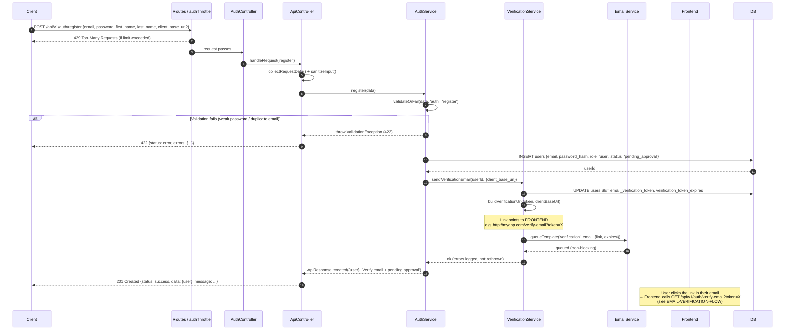
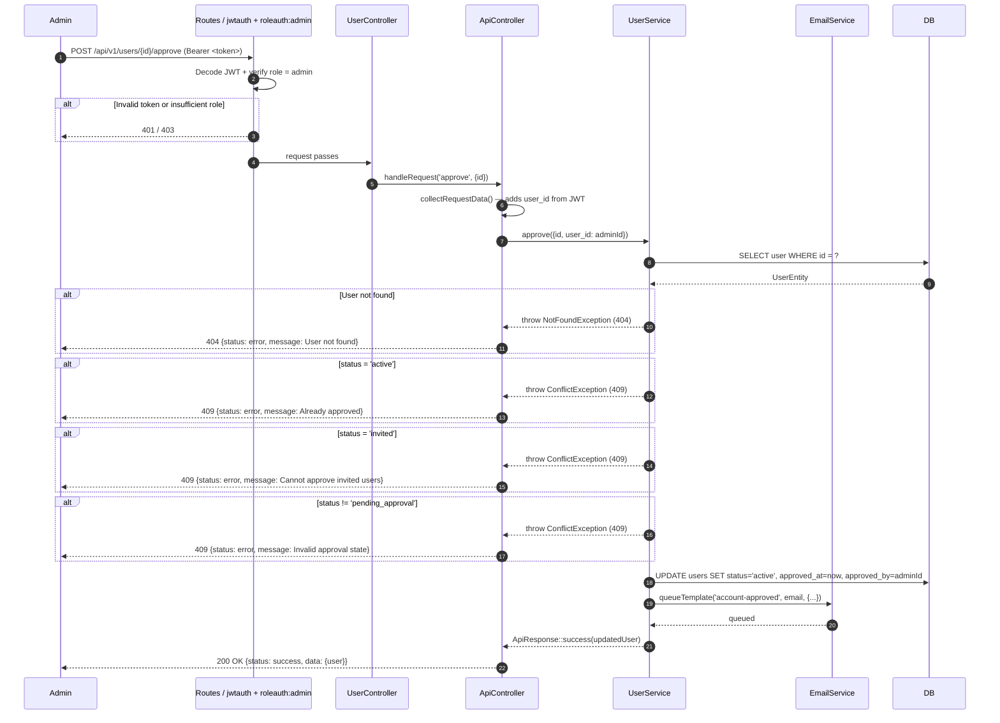
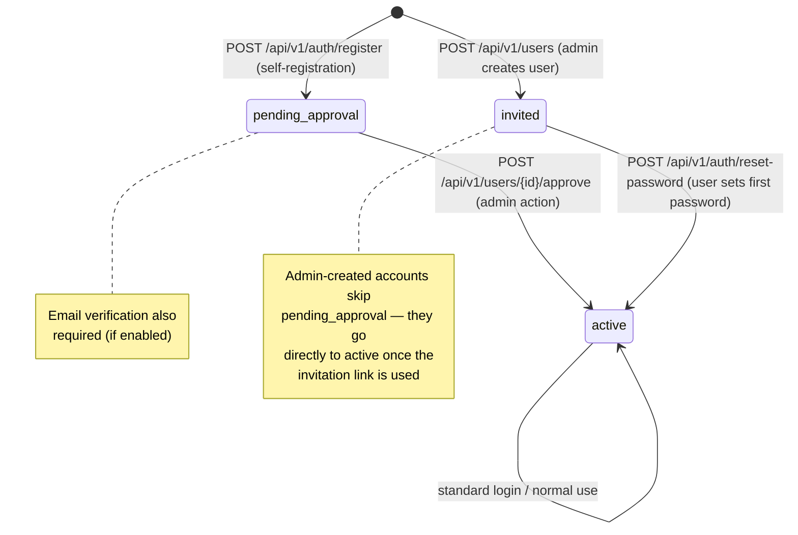

# Register and Approval Flow

## Overview

This flow covers two related sub-flows: **self-registration** (a user signs up via the public endpoint) and **admin approval** (an admin activates the account). A third path exists for **admin-invited users**, who receive a password-setup link directly rather than going through approval.

After self-registration the account is placed in `pending_approval` state. A verification email is also sent. Only once an admin calls the approval endpoint does the account become `active` and allow login.

---

## Sub-flow A — Self-registration

### Step-by-step

1. Client sends `POST /api/v1/auth/register` with `email`, `password`, `first_name`, `last_name`, and optionally `client_base_url`.
2. The `authThrottle` filter applies a per-IP rate limit.
3. `AuthController::register()` calls `handleRequest('register')`.
4. `ApiController::collectRequestData()` merges all request sources and sanitizes input.
5. `AuthService::register()` validates:
   - `password` must not be empty (`BadRequestException` if missing).
   - Full validation rules via `validateOrFail($data, 'auth', 'register')`: unique email, password strength, required fields.
6. User is inserted with:
   - `role = 'user'` (hardcoded — self-registration can never set a privileged role)
   - `status = 'pending_approval'`
   - Password hashed with `PASSWORD_BCRYPT`
7. `VerificationService::sendVerificationEmail(userId, {client_base_url})` is called:
   - Generates a random token, sets expiry to 24 hours from now.
   - Builds the verification link using `ResolvesWebAppLinks::buildVerificationUrl(token, clientBaseUrl)` — this points to the **frontend** (e.g. `http://myapp.com/verify-email?token=X`), not the API.
   - Queues the verification email (non-blocking; errors are logged but do not fail registration).
8. Response: `201 Created` with `{ user, message }` informing the user to verify their email and await admin approval.

### Diagram



---

## Sub-flow B — Admin approval

### Step-by-step

1. Admin lists pending users: `GET /api/v1/users?filter[status][eq]=pending_approval` (requires `jwtauth` + `roleauth:admin`).
2. Admin approves a user: `POST /api/v1/users/{id}/approve`.
3. The `jwtauth` filter decodes the Bearer token and sets `user_id` and `role` on the request. The `roleauth:admin` filter verifies the role.
4. `UserController` calls `handleRequest('approve', ['id' => $id])`.
5. `UserService::approve()` runs status guard clauses:
   - User not found → `NotFoundException` (404).
   - `status = 'active'` → `ConflictException` (409) "already approved".
   - `status = 'invited'` → `ConflictException` (409) "cannot approve invited users".
   - `status != 'pending_approval'` → `ConflictException` (409) invalid state.
6. Updates the user: `status = 'active'`, `approved_at = now()`, `approved_by = adminId`.
7. Queues an approval notification email (non-blocking).
8. Response: `200 OK` with the updated user object.
9. The user can now log in via the standard login flow.

### Diagram



---

## User state machine



---

## URL resolution for email links (ResolvesWebAppLinks)

Verification and invitation emails contain links that point to the **frontend**, not the API. The `ResolvesWebAppLinks` trait resolves the base URL as follows:

1. If `client_base_url` is present in the request body, validate it:
   - Must be a valid `http` or `https` URL (production requires `https`).
   - Must be present in the `WEBAPP_ALLOWED_BASE_URLS` allowlist.
   - If not in the allowlist: logs a warning and falls back to `WEBAPP_BASE_URL`.
2. If `client_base_url` is absent or invalid, fall back to `WEBAPP_BASE_URL` env var.
3. If `WEBAPP_BASE_URL` is also missing, fall back to `app.baseURL`.

Required environment variables:

```env
WEBAPP_BASE_URL=http://localhost:8081
WEBAPP_ALLOWED_BASE_URLS=http://localhost:8081,https://myapp.com
```

---

## Key validations

- `role` is always forced to `'user'` on self-registration — the client cannot set a privileged role.
- Password strength and unique email are validated by `validateOrFail()` using CI4 validation rules.
- Verification email errors do not roll back the registration; they are logged silently.
- Only users with `status = 'pending_approval'` can be approved. Other statuses produce a `ConflictException`.
- Admin endpoints require both `jwtauth` and `roleauth:admin` filters.

---

## Error cases

| Condition | Exception | HTTP | Notes |
|-----------|-----------|------|-------|
| Missing password | `BadRequestException` | 400 | Before validation rules |
| Validation fails (weak password, duplicate email) | `ValidationException` | 422 | From `validateOrFail()` |
| Rate limit exceeded (registration) | — (filter) | 429 | authThrottle filter |
| User not found (approval) | `NotFoundException` | 404 | — |
| User already active | `ConflictException` | 409 | Already approved |
| User is invited, not pending | `ConflictException` | 409 | Wrong flow |
| Invalid token or non-admin role (approval) | — (filter) | 401 / 403 | jwtauth / roleauth |

---

## Examples

Self-registration:

```bash
curl -X POST http://localhost:8080/api/v1/auth/register \
  -H "Content-Type: application/json" \
  -d '{
    "email": "user@example.com",
    "password": "MyPass123!",
    "first_name": "Jane",
    "last_name": "Doe",
    "client_base_url": "https://myapp.com"
  }'
```

Admin approval:

```bash
curl -X POST http://localhost:8080/api/v1/users/42/approve \
  -H "Authorization: Bearer ADMIN_ACCESS_TOKEN"
```
