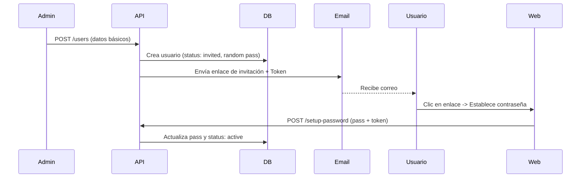

# Flujo de Invitación de Usuarios

Este documento describe el flujo obligatorio para la creación de usuarios desde el panel de administración.

## Concepto Clave

En esta arquitectura, **un administrador nunca establece la contraseña de un usuario**. El sistema garantiza la seguridad permitiendo que solo el usuario final conozca su credencial de acceso.

## Proceso de Creación

1.  **Solicitud:** El Admin envía `POST /api/v1/users` con los datos básicos (`email`, `firstName`, `lastName`, `role`).
2.  **Generación:** El `UserService` crea el registro en la base de datos:
    - Estado inicial: `invited`.
    - Contraseña: Se genera una cadena aleatoria de 48 caracteres que **nadie conoce**.
3.  **Notificación (Invitación):** El servicio dispara automáticamente el `InvitationService`.
    - Se genera un token único de invitación.
    - Se envía un correo electrónico al usuario con un enlace especial.
4.  **Activación:** El usuario hace clic en el enlace, lo que lo lleva al frontend para establecer su contraseña real. Al hacerlo, el estado pasa a `active`.

## ⚠️ Reglas de Integración

- **Frontend (Admin):** El formulario de creación **no debe** tener un selector para "Enviar invitación". La invitación no es opcional; es la única forma de que el usuario obtenga acceso.
- **Seguridad:** Los usuarios en estado `invited` no pueden iniciar sesión hasta que completen el flujo de establecimiento de contraseña.

## Diagrama de Secuencia

