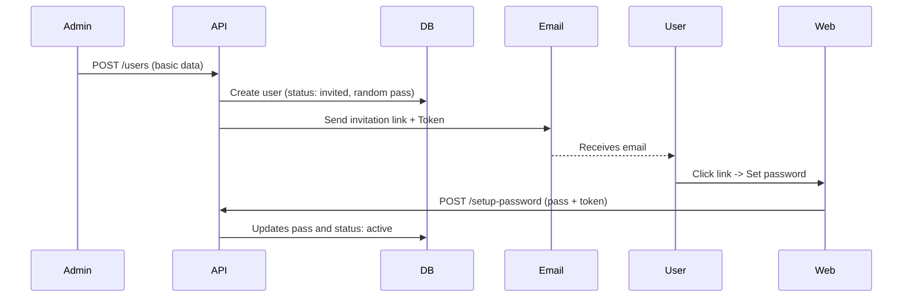

# User Invitation Flow

This document describes the mandatory flow for creating users from the administration panel.

## Key Concept

In this architecture, **an administrator never sets a user's password**. The system ensures security by allowing only the end user to know their access credential.

## Creation Process

1.  **Request:** The Admin sends `POST /api/v1/users` with basic data (`email`, `firstName`, `lastName`, `role`).
2.  **Generation:** The `UserService` creates the record in the database:
    - Initial status: `invited`.
    - Password: A 48-character random string is generated that **no one knows**.
3.  **Notification (Invitation):** The service automatically triggers the `InvitationService`.
    - A unique invitation token is generated.
    - An email is sent to the user with a special link.
4.  **Activation:** The user clicks the link, which takes them to the frontend to set their real password. Upon doing so, the status changes to `active`.

## ⚠️ Integration Rules

- **Frontend (Admin):** The creation form **must not** have a selector for "Send invitation". The invitation is not optional; it is the only way for the user to obtain access.
- **Security:** Users in the `invited` state cannot log in until they complete the password setup flow.

## Sequence Diagram

