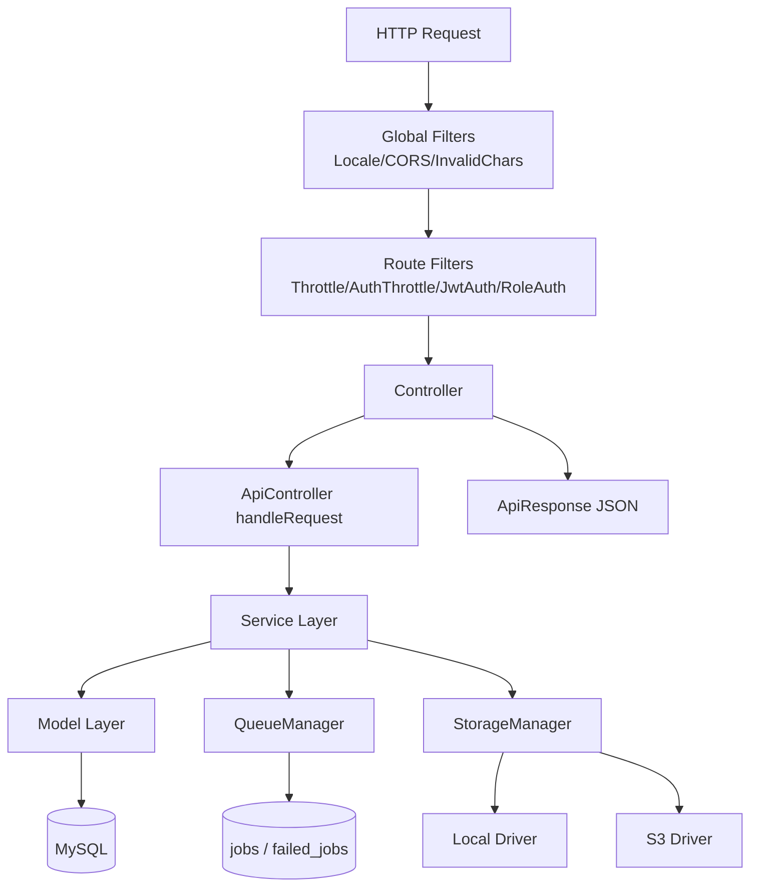

# Informe de Auditoría Técnica Profunda - CI4 API Starter

**Fecha de auditoría:** 18 de febrero de 2026  
**Framework:** CodeIgniter 4.5 + PHP 8.1+  
**Alcance base:** Código runtime (`app/`, `app/Config/`, `app/Database/`, `tests/`)  
**Prioridad solicitada:** Mantenibilidad y gestión de deuda técnica (sin degradar seguridad)

---

## 5.1 Resumen Ejecutivo

**Estado general:** **Necesita atención**  
**Score de calidad técnica:** **7.2/10**

**Justificación del score**
- Hay arquitectura en capas funcional (Controller/Service/Model/Entity) y cobertura de tests superior al promedio.
- Existen riesgos relevantes en trazabilidad de auditoría, robustez de migraciones y manejo de secretos/tokens que impactan sostenibilidad operativa.
- Hay decisiones maduras (filtros, interfaces, respuesta uniforme), pero con inconsistencias de implementación en piezas críticas.

**Top 3 fortalezas**
1. Arquitectura de servicios y contratos bien establecida (`app/Interfaces`, `app/Services`, `app/Controllers/ApiController.php`).
2. Cobertura de testing amplia por capas (56 archivos de test: 37 unit, 7 integration, 10 feature + soporte).
3. Base de seguridad sólida en filtros y hardening HTTP (`jwtauth`, `roleauth`, `throttle`, cabeceras de seguridad).

**Top 3 riesgos urgentes**
1. **Riesgo de exposición de secretos de recuperación/verificación** en flujos con token en query string y persistencia de token en claro (`app/Services/PasswordResetService.php:66`, `app/Services/VerificationService.php:49`).
2. **Auditoría sin actor confiable** por desacople entre request auth real y el trait de auditoría (`app/Traits/Auditable.php:209` vs `app/HTTP/ApiRequest.php:14`).
3. **Migraciones con tolerancia excesiva a fallos** (catch silencioso) y evidencia de fallas en suite por orden/estado de schema (`app/Database/Migrations/2026-01-28-210923_EnforceUserConstraints.php:15`, `app/Database/Migrations/2026-02-06-120000_UpdateUsersForNamesAndOAuth.php:12`).

---

## 1) Análisis de Arquitectura

### 1.1 Estructura del proyecto

**Cumplimiento CI4:** Bueno, con extensiones maduras.
- Controllers API: `app/Controllers/Api/V1`
- Servicios de negocio: `app/Services`
- Modelos y entidades: `app/Models`, `app/Entities`
- Filtros: `app/Filters`
- Librerías transversales: `app/Libraries`
- Configuración: `app/Config`
- DB: `app/Database/Migrations`, `app/Database/Seeds`

**Autoload y namespaces:** Correctos en `composer.json` (`App\\`, `Config\\`, `Tests\\`).

**Observación clave:** existe separación por capas, pero con focos de acoplamiento por instanciación directa (`new`) en algunos componentes transversales (cola, storage, servicios de jobs).

### 1.2 Arquitectura implementada

Arquitectura actual: **MVC extendido con Service Layer + filtros tipo middleware + librerías de infraestructura**.

- MVC puro: No.
- Capa de servicios: Sí, consistente.
- Repositories explícitos: No (se usa Model de CI4 como repositorio implícito).
- DTOs explícitos: No.
- Separación negocio/presentación: Alta (API JSON, sin lógica de negocio en controllers salvo excepciones observabilidad).

### 1.3 Calidad del modelo de datos

**Fortalezas**
- Modelo de usuarios, tokens, auditoría, métricas y archivos con llaves/índices básicos.
- Uso de traits de consulta (`Filterable`, `Searchable`) con whitelists de campos.

**Riesgos**
- Migraciones con excepciones ignoradas silenciosamente.
- Tokens de recuperación/verificación almacenados en texto claro.
- Cálculo percentil en memoria para métricas de requests (escalabilidad limitada).

---

## 2) Patrones de Diseño - Hallazgo y Calidad

| Patrón | Estado | Evidencia | Evaluación |
|---|---|---|---|
| Factory | Implementado | `app/Config/Services.php`, `app/Libraries/Storage/StorageManager.php` | Correcto, aunque con margen de DI más estricto |
| Singleton (contenedor compartido) | Implementado | `BaseService::getSharedInstance` | Correcto |
| Builder (consulta) | Parcial | `app/Libraries/Query/QueryBuilder.php` | Útil, pero no es Builder completo de dominio |
| Adapter | Implementado | `LocalDriver`/`S3Driver` vía `StorageDriverInterface` | Correcto |
| Facade | Implementado | `ApiResponse`, `Services` | Correcto |
| Decorator | Ausente | N/A | No crítico hoy |
| Repository | Parcial/implícito | Models de CI4 | Ausencia explícita aumenta acoplamiento al ORM |
| Observer | Implementado | callbacks en `Auditable` trait | Correcto en intención, defectuoso en captura de actor |
| Strategy | Implementado | drivers storage, operadores de filtro, búsqueda | Correcto |
| Command | Implementado | Jobs de cola (`SendEmailJob`, `LogRequestJob`) | Correcto |
| Middleware/Pipeline | Implementado | filtros CI4 | Correcto |

---

## 3) Mapeo de Flujos del Sistema

### 3.1 Autenticación y autorización

**Login/registro/token**
1. `POST /api/v1/auth/login` -> `AuthController::login` -> `AuthService::loginWithToken`.
2. `AuthService` valida credenciales, estado, verificación email, genera JWT + refresh token.
3. `JwtAuthFilter` valida token, revocación y estado de usuario.
4. `RoleAuthorizationFilter` impone RBAC en rutas admin.

**Reset password / verify email**
1. `POST /auth/forgot-password` genera token y envía email.
2. `POST /auth/reset-password` valida token + política password y actualiza hash.
3. `GET/POST /auth/verify-email` valida token de verificación y activa email.

### 3.2 Flujos de negocio principales

- **Usuarios**: `UserController -> UserService -> UserModel` (CRUD + approve).
- **Archivos**: `FileController -> FileService -> StorageManager + FileModel`.
- **Audit**: `AuditController -> AuditService -> AuditLogModel`.
- **Metrics**: `MetricsController -> RequestLogModel/MetricModel`.

### 3.3 Flujos de datos

- Validación mixta en helpers, servicios y modelos.
- Sanitización global de strings en `ApiController::sanitizeInput`.
- Manejo de errores por excepciones personalizadas + respuesta uniforme.

### 3.4 Flujos de integración

- Email: Symfony Mailer + cola DB.
- Storage: local/S3 por estrategia.
- Jobs: tabla `jobs`/`failed_jobs`.
- Monitoring: endpoints health/ready/live + métricas.

---

## 4) Inventario de Hallazgos

| ID | Descripción | Tipo | Severidad | Archivo/Módulo |
|---|---|---|---|---|
| A-001 | Token de reset persiste en claro y viaja en query string | Seguridad | 🔴 Crítico | `app/Services/PasswordResetService.php:66` |
| A-002 | Token de verificación persiste en claro y se consulta directo | Seguridad | 🔴 Crítico | `app/Services/VerificationService.php:49` |
| A-003 | Auditoría no obtiene `user_id` autenticado por mismatch de contrato request | Trazabilidad/Arquitectura | 🟠 Alto | `app/Traits/Auditable.php:209`, `app/HTTP/ApiRequest.php:14` |
| A-004 | Migraciones con `catch` silencioso generan estado incierto de schema | Datos/Operación | 🟠 Alto | `app/Database/Migrations/2026-01-28-210923_EnforceUserConstraints.php:15` |
| A-005 | Migración de users con múltiples operaciones ignorando fallas | Datos/Operación | 🟠 Alto | `app/Database/Migrations/2026-02-06-120000_UpdateUsersForNamesAndOAuth.php:12` |
| A-006 | Suite de tests evidencia fragilidad de migraciones DB (`users` inexistente en migración posterior) | Calidad/Confiabilidad | 🟠 Alto | `app/Database/Migrations/2026-01-28-070454_AddPasswordToUsers.php:11` |
| A-007 | Percentiles de métricas cargan todos los response times en memoria | Rendimiento | 🟠 Alto | `app/Models/RequestLogModel.php:55` |
| A-008 | Lectura completa de archivos en memoria antes de persistir | Rendimiento/Estabilidad | 🟡 Medio | `app/Services/FileService.php:97` |
| A-009 | Generación de filename con `uniqid()` predecible | Seguridad | 🟡 Medio | `app/Services/FileService.php:330` |
| A-010 | Sanitización global por `strip_tags` puede alterar payloads válidos y crear comportamiento inesperado | Mantenibilidad/Correctitud | 🟡 Medio | `app/Controllers/ApiController.php:157` |
| A-011 | Query raw interpolada para `BINARY` comparison (segura parcialmente, difícil de mantener) | Seguridad/Mantenibilidad | 🟡 Medio | `app/Models/TokenBlacklistModel.php:52` |
| A-012 | Instanciación directa de `QueueManager` en filtro (acoplamiento) | Arquitectura | 🟡 Medio | `app/Filters/RequestLoggingFilter.php:60` |
| A-013 | PhpStan no ejecutable en sandbox actual (EPERM tcp bind), reduce señal de calidad en auditoría local | DevEx | 🟡 Medio | `composer phpstan` |
| A-014 | Inconsistencia entre conteo histórico documentado y suite real de pruebas | Gobernanza técnica | 🟢 Bajo | `docs/reports/AUDIT_REPORT.es.md` |
| A-015 | Mezcla de fuentes de validación (helper/model/service) aumenta duplicación conceptual | Arquitectura | 🟢 Bajo | `app/Helpers/validation_helper.php`, modelos/servicios |

---

## 5.3 Mapa de Arquitectura Actual



**Descripción de capas**
- Presentación HTTP: controllers + filtros.
- Aplicación: servicios con reglas de negocio.
- Persistencia: modelos CI4 y migraciones.
- Infraestructura: cola, correo, storage, logging, monitoring.

---

## 5.4 Deuda Técnica Estimada

Estimación para **1 dev senior** (ejecución secuencial).

| Categoría | Esfuerzo estimado | Riesgo si no se atiende |
|---|---:|---|
| Seguridad crítica (tokens, secretos, URLs) | 24-32 h | Alto riesgo de account takeover ante fuga de DB/logs |
| Migraciones y confiabilidad de schema | 20-30 h | Drift de esquema, fallas intermitentes en CI/CD |
| Trazabilidad de auditoría (actor y eventos) | 10-14 h | Auditoría incompleta/no forense |
| Rendimiento (métricas + upload I/O) | 16-24 h | Degradación bajo carga y picos de memoria |
| Desacoplamiento/DI y contratos | 18-28 h | Incremento de costo de cambio y pruebas frágiles |
| Normalización de validación/errores | 12-20 h | Reglas duplicadas e inconsistentes |
| **Total estimado** | **100-148 h (12.5-18.5 días)** | Riesgo acumulado creciente por deuda no amortizada |

---

## 6) Plan de Mejoras Priorizado

## Sprint 0 - Estabilización (Semana 1-2)

### Acción S0-1: Hashear tokens de reset/verificación y usar comparación constante
- **Qué hacer:** almacenar hash del token, no el token plano.
- **Justificación:** reduce impacto de exfiltración de DB.
- **Esfuerzo:** 8-12 h.
- **Impacto:** alto (seguridad).

**Antes** (`app/Services/PasswordResetService.php`)
```php
$token = generate_token();
$this->passwordResetModel->insert(['token' => $token]);
```

**Después**
```php
$token = generate_token();
$tokenHash = hash('sha256', $token);
$this->passwordResetModel->insert(['token' => $tokenHash]);
// validación: hash_equals($storedHash, hash('sha256', $incomingToken))
```

### Acción S0-2: Evitar token en query string para operaciones sensibles
- **Qué hacer:** mover token a body/header; al menos en reset/verify final.
- **Justificación:** query strings quedan en logs/proxies/historial.
- **Esfuerzo:** 6-10 h.
- **Impacto:** alto.

### Acción S0-3: Reparar captura de actor en auditoría
- **Qué hacer:** usar `ApiRequest::getAuthUserId()` en trait/model callbacks.
- **Justificación:** sin actor no hay auditoría forense útil.
- **Esfuerzo:** 4-6 h.
- **Impacto:** alto.

**Antes** (`app/Traits/Auditable.php:209`)
```php
if (property_exists($request, 'userId')) {
    return (int) $request->userId;
}
```

**Después**
```php
if ($request instanceof \App\HTTP\ApiRequest) {
    return $request->getAuthUserId();
}
```

### Acción S0-4: Endurecer migraciones para fallar explícitamente
- **Qué hacer:** reemplazar catches silenciosos por logging + fallo controlado/guard clauses verificables.
- **Justificación:** evita drift silencioso.
- **Esfuerzo:** 6-8 h.
- **Impacto:** alto.

## Horizonte 1 - Refactorización Base (1-2 meses)

### Acción H1-1: Introducir repositorios explícitos para dominios críticos
- **Qué hacer:** `UserRepository`, `TokenRepository`, `AuditRepository` con interfaces.
- **Justificación:** reduce acoplamiento a Model CI4 y facilita testing.
- **Esfuerzo:** 30-45 h.
- **Impacto:** alto en mantenibilidad.

### Acción H1-2: Unificar validación de entrada por caso de uso
- **Qué hacer:** concentrar reglas en un solo punto por action (Request DTO + validator dedicado).
- **Justificación:** elimina reglas duplicadas helper/model/service.
- **Esfuerzo:** 16-24 h.
- **Impacto:** medio-alto.

### Acción H1-3: Estandarizar DI en filtros/jobs (sin `new` en runtime)
- **Qué hacer:** resolver dependencias desde `Config\Services`.
- **Justificación:** testabilidad y reemplazo de infraestructura.
- **Esfuerzo:** 10-16 h.
- **Impacto:** medio-alto.

### Acción H1-4: Corregir pruebas de DB/migraciones y pipeline de calidad
- **Qué hacer:** estabilizar orden/estado de migraciones en tests, separar tests unit sin DB real.
- **Justificación:** suite confiable para CI/CD.
- **Esfuerzo:** 18-28 h.
- **Impacto:** alto.

## Horizonte 2 - Arquitectura Sostenible (3-6 meses)

### Acción H2-1: Optimización de métricas y queries pesadas
- **Qué hacer:** percentiles por SQL aproximado/materialización; limitar ventanas de lectura.
- **Justificación:** evitar carga completa en memoria.
- **Esfuerzo:** 20-30 h.
- **Impacto:** alto en escalabilidad.

### Acción H2-2: Mejorar modelo de archivos (streaming + nombres criptográficamente fuertes)
- **Qué hacer:** subir por stream, reemplazar `uniqid()` por `bin2hex(random_bytes())`.
- **Justificación:** memoria + predictibilidad de identificadores.
- **Esfuerzo:** 12-18 h.
- **Impacto:** medio-alto.

### Acción H2-3: ADRs y arquitectura target formal
- **Qué hacer:** documentar decisiones clave (tokens, repositorios, validación, observabilidad).
- **Justificación:** evita regresiones de diseño.
- **Esfuerzo:** 8-12 h.
- **Impacto:** medio.

### Acción H2-4: CI/CD de calidad reforzada
- **Qué hacer:** quality gates (unit/integration/feature), cobertura mínima, análisis estático en entorno sin restricciones.
- **Justificación:** gobernanza técnica continua.
- **Esfuerzo:** 12-20 h.
- **Impacto:** alto.

---

## Evidencia de Ejecución de Auditoría

### Pruebas ejecutadas
- `vendor/bin/phpunit tests/Unit --testdox`
  - **Resultado:** 453 tests, 835 assertions, 49 errores, 3 fallos.
  - **Patrón dominante de error:** fallos de DB/migraciones (`Table 'ci4_test.users' doesn't exist`) en múltiples tests de traits/librerías.
- `composer phpstan`
  - **Resultado:** no ejecutable en sandbox actual por `EPERM` al abrir socket local (`tcp://127.0.0.1:0`).

### Riesgo residual explícito
- El análisis estático no pudo completarse por limitación del entorno, no por ausencia de configuración.

---

## Conclusión

El proyecto está **bien encaminado arquitectónicamente** y posee una base de ingeniería madura para evolucionar. Sin embargo, la combinación de **tokens sensibles en claro**, **auditoría con actor inconsistente** y **migraciones tolerantes a fallo silencioso** mantiene la plataforma en estado “necesita atención”.

La estrategia recomendada no es reescritura: es **remediación incremental guiada por riesgo**, comenzando por Sprint 0 para seguridad/confiabilidad y continuando con refactor de contratos y desempeño.
